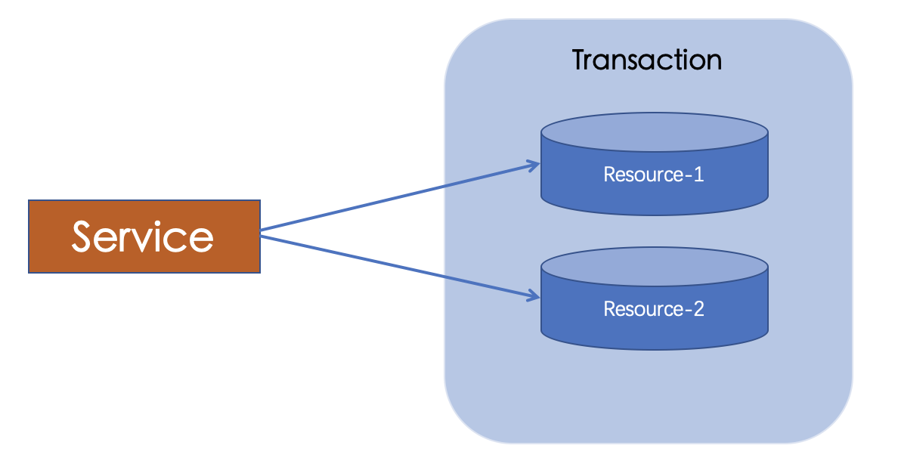
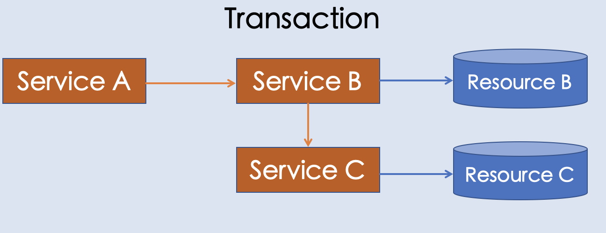

# TCC分布式事务

### 一、事务

#### 1、什么事务

数据库事务指一个逻辑工作单元，由一些列操作组成，这些操作要么完全执行，要么完全不执行。因此事务必须满足所谓的ACID特性（原子性、一致性、隔离性和持久性）

##### （1）原子性（Atomicity）

指事务包含的所有操作要么全部成功，要么全部失败回滚。

##### （2）一致性（Consistency）

指事务必须使数据库从一个一致性状态变换到另一个一致性状态，也就是说一个事务执行之前和执行之后都必须处于一致性状态。

##### （3）隔离型（Isolation）

隔离性是当多个用户并发访问数据库时，比如操作同一张表时，数据库为每一个用户开启的事务，不能被其他事务的操作所干扰，多个并发事务之间要相互隔离。关于事务的隔离性数据库提供了多种隔离级别，稍后会介绍到。

##### （4）持久性（Durability）

持久性是指一个事务一旦被提交了，那么对数据库中的数据的改变就是永久性的，即便是在数据库系统遇到故障的情况下也不会丢失提交事务的操作。

#### 2、事务并发会导致的问题

当多个事务同时访问数据库中相同数据时，如果没有采取必要的隔离机制，就会导致各种并发问题。归纳如下：

1、脏读（dirty read）：一个事务读取了另一个事务尚未提交的数据。

2、幻读（phantom read）：一个事务的操作导致另一个事务前后两次读取到不同的数据。 

3、不可重复读(non-repeatable read)：一个事务的操作导致另一个事务前后两次读取到不同的数据。

第一类丢失更新：撤销一个事务时，把其他事务已提交的更新数据覆盖。

第二类丢失更新：是不可重复读的特殊情况。如果两个事物都读取同一行，然后两个都进行写操作，并提交，第一个事物所做的改变就会丢失。

#### 3、事务隔离级别

- **Serializable(串行化)**：一个事务在执行过程中完全看不到其他事务对数据库所做的更新。极大降低并发能力，实际场景中很少使用。

- **Repeatable Read(可重复读)**：一个事务在执行过程中可以看到其他事务已经提交的新插入的记录，但是不能看到其他事务对已有记录的更新。
- **Read Commited（读已提交数据）**：一个事务在执行过程中可以看到其他事务已经提交的新插入的记录，而且能看到其他事务已经提交的对已有记录的更新 。
- **Read Uncomitted（读未提交数据）**：一个事务在执行过程中可以拷打其他事务没有提交的新插入的记录，而且能看到其他事务没有提交的对已有记录的更新。隔离级别过低，实际场景中很少使用。

| 隔离级别（Isolation levels）        | 脏读（Dirty read） | 不可重复读（NonRepeatable Read） | 幻读（Phantom Read） |
| ----------------------------------- | ------------------ | -------------------------------- | -------------------- |
| **Serializable(可串行化)**          | 不可能             | 不可能                           | 不可能               |
| **Repeatable Read(可重复读)**       | 不可能             | 不可能                           | 可能                 |
| **Read Commited（读已提交数据）**   | 不可能             | 可能                             | 可能                 |
| **Read Uncomitted（读未提交数据）** | 可能               | 可能                             | 可能                 |

### 二、分布式事务

随着互联网带来的海量数据规模，单一的集中的IT架构无法满足计算和存储的需求，进行垂直分割和水平分割，把大的单体应用转型为微服务，虽则服务模块化拆分，同时还有数据库的垂直拆分，根据业务系统功能，将数据库拆分为多个，每个系统使用独立的数据库。数据拆分后，解决了单机存储容量和性能问题，但也带来了数据一致性问题。如何保证跨库，跨应用业务操作的原子性。

**应用场景1：单服务多资源**

**应用场景2：跨服务**

**应用场景3：嵌套服务**

#### 2-1、XA协议模型

最早的分布式事务模型由X/Open国际联盟提出的X/OpenXA协议，简称XA协议。

**原子性**：利用数据资源层的特性进行两阶段操作：准备阶段和提交阶段。

*准备阶段*：TM向每个RM发送准备消息，如果RM的本地事务操作成功，则执行成功；否则返回失败。

*提交阶段*：如果TM收到了所有RM回复的成功消息，则向每个RM发送提交指令；否则发送回滚指令；RM根据TM的指令执行提交或者回滚本地事务操作。释放所有事务处理过程中使用的资源锁。

**隔离性**： XA协议没有描述如何实现隔离性，由于XA协议要求每个RM都要实现本地事务。也就是说，XA分布式事务的隔离性是由本地事务来保证的。常见的方式是通过两阶段锁来实现，第一阶段只加锁，第二阶段只放锁，不加锁。

**一致性**：一致性有两层语义：

一层是确保事务执行结束后，数据库从一个一致状态转变为另一个一致状态，通过原子性，隔离性以及RM自身的一致性的实现就可以保障。另一层语义是事务执行过程中的中间状态不能被观察到，单机的实现主要通过MVCC（Multi Version Concurrency Control，多版本并发控制)来实现。XA协议并没有定义如何实现全局Snapshot。 关键是确定事务之间的happen-before关系，基本思路是使用逻辑上单调递增的东西来控制全局snapshot，从而实现不同隔离级别的一致性。比如google的spanner就是用原子钟的truetime来控制全局snapshot。

**持久性**：由每个RM来保障。

XA协议通常是现在数据库资源层，那么基于XA协议实现的分布式数据库，分布式事务框架，对业务几乎零侵入。能够严格保证事务ACID特性，满足所有业务领域的功能要求，但弊端就是性能开销过大。由于隔离性中（读写，写读，写写）的互斥要求，在事务执行过程中，所有资源都被锁定，只适用于执行时间确定的短事务。同时，整个事务期间都是独占数据，极大降低热点数据的并发性能，实现了分布式MVCC或乐观锁以后，性能可能会有所提升。

同时，为了保证一致性，要求所有RM同等可信，可靠，要求故障回复机制可靠，快速，在网络故障隔离的情况下，服务基本不可用。

#### 2-2、基于业务补偿的TCC事务模型：

相对于XA模型来说，TCC（Try-Confirm-Cancel）分布式事务模型不依赖资源管理器（RM）对分布式事务的支持，而是通过业务逻辑的分解来实现分布式事务。适当降低一致性，达到BASE理论要求的，“基本可用，最终一致”。BASE 理论是指BA（Basic Availability，基本业务可用性）；S（Soft state，柔性状态）；E（Eventual consistency，最终一致性）。

TCC 模型认为对于业务系统中一个特定的业务逻辑，其对外提供服务时，必须接受一些不确定性，即对业务逻辑初步操作的调用仅是一个临时性操作，调用它的主业务服务保留了后续的取消权。如果主业务服务认为全局事务应该回滚，它会要求取消之前的临时性操作，这就对应从业务服务的取消操作。而当主业务服务认为全局事务应该提交时，它会放弃之前临时性操作的取消权，这对应从业务服务的确认操作。每一个初步操作，最终都会被确认或取消。

因此，针对一个具体的业务服务，TCC 分布式事务模型需要业务系统提供三段业务逻辑：

- 初步操作 Try：

    完成所有业务检查，预留必须的业务资源。

- 确认操作 Confirm：

    真正执行的业务逻辑，不作任何业务检查，只使用 Try 阶段预留的业务资源。

    因此，只要 Try 操作成功，Confirm 必须能成功。另外，Confirm 操作需满足幂等性，保证一笔分布式事务有且只能成功一次。

- 取消操作 Cancel：

    释放 Try 阶段预留的业务资源。同样的，Cancel 操作也需要满足幂等性

在并发处理方面，由于TCC模型相对于XA模型进一步减少了资源锁的持有时间，TCC模型中，Try阶段就提交事务，从而释放锁定的资源；而不是像XA那样整个Prepare阶段一直持有锁。因此TCC比XA模型具有较大的性能提升。从理论上讲，只要Try阶段完成，Confirm/Cancel阶段什么时候执行都可以，因为资源已经被锁定，不会被其他事务使用；这就给异步执行提供了可能，在业务并发高峰时期，可以使用框架内部的事件队列来处理二阶段操作

TCC实际上，就是把数据资源层的两阶段提交上提到了应用层来实现。本质上，TCC也是两阶段完成事务执行，追求数据的最终一致性，而不是实时一致性。TCC缺点主要是有一定的开发成本：因为Try，Confirm和Cancel操作功能需要业务提供。

##### TCC事务的核心概念如下

- **发起者主事务**：
  - 作为tcc事务发起者，负责发起并管理包括所有参与者的整个业务活动。
  - 捕获到异常，调用所有参与者的cancel方法
  - 正常结束后，调用所有参与者的confirm方法
- **参与者从事务**：
  - 负责提供tcc业务操作，是整个业务活动的参与方。
  - 必须实现Try，Confirm，Cancel三个方法供事务发起者调用。
- **事务管理器**：
  - 每个TCC事务的发起方，参与方都各自维护各自的TCC事务，封装参与者调用点，并持久化到存储设备上。
  - 每个服务内置的TCC事务管理器负责，对自身的所有参与者执行确认或取消操作。
  - 每个TCC事务根据参与者的执行状态进行失败重试。
  - 内置的TCC事务根据当前执行状态判断是否重新执行确认或者取消操作，保证每个confirm或者cancel能且只能执行一次。
- **TRY操作**：
  - 完成业务检查，预留必须的业务资源。
- **Confirm确认操作**：
  - 真正执行业务逻辑，不需要做任何业务检查，只Try阶段预留的业务资源。
  - Confirm操作需要满足幂等性。
- **Cancel取消操作：**
  - 释放Try阶段预留的业务资源。
  - 同样，Cancel操作需要满足幂等性。

在进行TCC框架设计时，考虑到从业务层面保证幂等性往往代价很大；我在TCC事务管理器根据状态机来保证Confirm能且仅被执行一次。

一个完整的 TCC 分布式事务流程如下：

　　主业务服务首先开启本地事务;

　　主业务服务向业务活动管理器申请启动分布式事务主业务活动;

　　然后针对要调用的从业务服务，主业务活动先向业务活动管理器注册从业务活动，然后调用从业务服务的 Try 接口;

　　当所有从业务服务的 Try 接口调用成功，主业务服务提交本地事务;若调用失败，主业务服务回滚本地事务;

　　若主业务服务提交本地事务，则 TCC 模型分别调用所有从业务服务的 Confirm 接口;若主业务服务回滚本地事务，则分别调用 Cancel 接口;

　　所有从业务服务的 Confirm 或 Cancel 操作完成后，全局事务结束。

**原子性**：

TCC模型在应用实现了2PC（2PC原子提交协议）来保证事务原子性。Try操作对应一阶段准备；Confirm对应2PC的二阶段提交（Commit），Cancel对应2PC的二阶段回滚（Rollback）。

**隔离性**：

TCC 分布式事务模型仅提供两阶段原子提交协议，保证分布式事务原子性。事务的隔离交给业务逻辑来实现。

隔离的本质是控制并发，防止并发事务操作相同资源而引起的结果错乱。

　　举个例子，比如金融行业里管理用户资金，当用户发起交易时，一般会先检查用户资金，如果资金充足，则扣除相应交易金额，增加卖家资金，完成交易。如果没有事务隔离，用户同时发起两笔交易，两笔交易的检查都认为资金充足，实际上却只够支付一笔交易，结果两笔交易都支付成功，导致资损。

　　可以发现，并发控制是业务逻辑执行正确的保证，但是像两阶段锁这样的并发访问控制技术要求一直持有数据库资源锁直到整个事务执行结束，特别是在分布式事务架构下，要求持有锁到分布式事务第二阶段执行结束，也就是说，分布式事务会加长资源锁的持有时间，导致并发性能进一步下降。

　　因此，TCC 模型的隔离性思想就是通过业务的改造，在第一阶段结束之后，从底层数据库资源层面的加锁过渡为上层业务层面的加锁，从而释放底层数据库锁资源，放宽分布式事务锁协议，提高业务并发性能。

　　还是以上面的例子举例：

　　第一阶段：检查用户资金，如果资金充足，冻结用户本次交易资金，这笔资金被业务隔离，不允许除本事务之外的其它并发事务动用。

　　第二阶段：扣除第一阶段预冻结的用户资金，增加卖家资金，完成交易。 采用业务加锁的方式，隔离用户冻结资金，在第一阶段结束后直接释放底层资源锁，该用户和卖家的其他交易都可以立刻并发执行，而不用等到整个分布式事务结束，可以获得更高的并发交易能力。

**一致性**：

来看看 TCC 分布式事务模型下的一致性实现。与 XA 协议实现一致性第一层语义类似，通过原子性保证事务的原子提交、业务隔离性控制事务的并发访问，实现分布式事务的一致性状态转变。至于第二层语义：事务的中间状态不能被观察到。

我们来看看，在 SOA分布式应用环境下是否是必须的。

　　还是以账务服务举例。转账业务(用户 A 给 用户 B转账)，由交易服务和账务服务组成分布式事务，交易服务作为主业务服务，账务服务作为从业务服务，账务服务的 Try 操作预冻结用户 A 的资金;Commit 操作扣除用户 A 的预冻结资金，增加用户 B 的可用资金;Cancel 操作解冻用户 A 的预冻结资金。

　　当账务服务执行完 Try 阶段后，交易主业务就可以 Commit 了，然后由TCC 框架调用账务的 Commit 阶段。在账务 Commit 阶段还没执行结束的时候，用户 A 可以查询到自己的余额已扣除，但是，此时用户 B 的可用资金还没增加。

　　从系统的角度来看，确实有问题与不确定性。在第一阶段执行结束到第二阶段执行结束之间，有一段时间的延时，在这段时间内，看似任何用户都不享有这笔资产。

　　但是，从用户的角度来考虑这个问题的话，这个时间间隔可能就无所谓或者根本就不存在。特别是当这个时间间隔仅仅是几秒钟，对于具体沟通资产转移的用户来讲，这个过程是隐蔽的或确实可以接受的，且保证了结果的最终一致性。

　　当然，对于这样的系统，如果确实需要查看系统的某个一致性状态，可以采用额外的方法实现。

　　一般来讲，服务之间的一致性比服务内部的一致性要更加容易弱化，这也是为什么 XA 等直接在资源层面上实现通用分布式事务的模型会注重一致性的保证，而当上升到服务层面，服务与服务之间已经实现了功能的划分，逻辑的解耦，也就更容易弱化一致性，这就是 SOA 架构下 BASE 理论的最终一致性思想。

　　BASE 理论是指 BA(Basic Availability，基本业务可用性);S(Soft state，柔性状态);E(Eventual consistency，最终一致性)。该理论认为为了可用性、性能与降级服务的需要，可以适当降低一点一致性的要求，即“基本可用，最终一致”。

　　业内通常把严格遵循 ACID 的事务称为刚性事务;而基于 BASE 思想实现的事务称为柔性事务。柔性事务并不是完全放弃了 ACID，仅仅是放宽了一致性要求：事务完成后的一致性严格遵循，事务中的一致性可适当放宽;

### 三、小结

TCC 分布式事务模型的业务实现特性决定了其可以跨 DB、跨服务实现资源管理，将对不同的 DB 访问、不同的业务操作通过 TCC 模型协调为一个原子操作，解决了分布式应用架构场景下的事务问题。

TCC 模型通过 2PC 原子提交协议保证分布式事务的的原子性，把资源层的隔离性上升到业务层，交给业务逻辑来实现。TCC 的每个操作对于资源层来说，就是单个本地事务的使用，操作结束则本地事务结束，规避了资源层在 2PC 和 2PL 下对资源占用导致的性能低下问题。

同时，TCC 模型也可以根据业务需要，做一些定制化的功能，比如交易异步化实现削峰填谷等。

但是，业务接入 TCC 模型需要拆分业务逻辑成两个阶段，并实现 Try、Confirm、Cancel 三个接口，定制化程度高，开发成本高。

随着技术的发展，特别是 SOA 分布式应用架构以及微服务时代的到来，服务变成了基本业务单元。因此，又产生了跨服务的分布式事务需求。然后从 XA 和 TCC 两种常用的分布式事务模型入手，介绍了其实现机制，着重分析了各模型是如何实现分布式事务 ACID 特性的。

### 参考资料

《大规模SOA系统中的分布式事务处理》：蚂蚁金服CTO程立早年的一篇关于分布式事务的PPT，里面有关于大规模SOA系统中包括TCC在内的各种分布式事务处理方案，是支付宝在分布式事务实践的经验精华。

[《Atomic Distributed Transactions: a RESTful Design》](res/Atomic Distributed Transactions--a RESTful Design.pdf)：ATOMIKOS公司的Guy Pardon和另一位作者一同写的一篇关于TCC事务设计方案的论文，对TCC的实现细节描述较为清楚