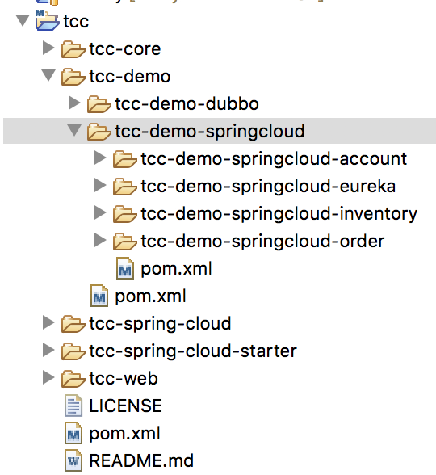

TCC分布式事务框架使用指南--springcloud
================

#### 前提条件

由于TCC事务涉及到多个服务，在springcloud框架上下游服务通过http rest方式调用。为了进行统一的切面处理，框架使用`@TccBizAction`注解对业务层的Try，Confirm，Cancel方法进行补偿切面，同时把RPC参与方（Feignclient）加入事务协调器中。

因此，springcloud框架接入前提是使用Feignclient进行远程调用，而非httpclient调用。


### 一、常规步骤

#### 1 引入依赖包

对于需要进行事务补偿的服务，需要引入tcc-spring-cloud-starter启动依赖jar包，maven代码如下：

```xml
<dependency>
  <groupId>org.xuyi</groupId>
  <artifactId>tcc-spring-cloud-starter</artifactId>
  <version>0.0.1-SNAPSHOT</version>
</dependency>
```

#### 2 编辑配置文件

主要指定Tcc事务存储的数据库连接。暂未支持其他类型持久化方式，暂未实现`serializer`的可配置化。

```yaml
tcc:
  serializer: com.tcc.core.serializer.KryoSerializer
  repositorySupport: db
  tccDbConfig:
    driverClassName: com.mysql.jdbc.Driver
    url: jdbc:mysql://localhost:3306/tcc?useUnicode=true&amp;characterEncoding=utf8&useSSL=false
    username: root
    password: root
```

#### 3 编写TCC业务代码

1.在服务提供方Try阶段的实现方法上加上`@TccBizAction`注解，并且，设置注解的属性``confirmAction``，``cancelAction``

同时提供confirmAction，cancelAction地实现方法。

```java
	@Transactional
	@TccBizAction(confirmAction = "confirmAction", cancelAction = "cancelAction")
	public boolean decrease(InventoryDTO inventoryDto) {
        //do trying business: lock resource
    }
	public boolean confirmAction(InventoryDTO inventoryDto) {
		//do confirm business
	}

	public boolean cancelAction(InventoryDTO inventoryDto) {
		//do cancel action
	}
```

- [ ] 辨析：单机事务注解`@Transactional`与`@TccBizAction`有各自作用域和各自处理逻辑，不冲突。需要从业务层面考虑try阶段是否需要异常回滚，try阶段的操作影响confirm和cancel的处理。应当作为一个整体对待。


2.进行RPC调用时，在Feignclient上面指定Feignclient的配置原型`TccFeignConfiguration`

接口方法加上注解`TccBizAction`，并且不能设置属性。

```java
@FeignClient(value = "inventory-service", configuration = TccFeignConfiguration.class)
public interface InventoryService {
    /**库存扣减**/
    @RequestMapping("/inventory-service/inventory/decrease")
	@TccBizAction
	Boolean decrease(@RequestBody InventoryDTO inventoryDTO);
}
```


### 二、DEMO项目

我们以电商的订单场景为例，订单服务，用户账户服务和库存服务，eureka为注册中心。项目结构如下：



#### Eureka

首先启动eureka服务，RPC调用（feinclient）需要eureka来发现服务。

#### 订单应用

我们对业务模型进行简化，订单接口定义如下：

参数：商品数量`count`和交易金额`amount`，用户ID `userid`（固定为10000），商品ID `productId`（固定为1）

调用订单服务`orderService`创建订单并且进行扣除账户余额支付，并进行库存扣减操作.

```java
@RestController
@RequestMapping("/order")
public class OrderController {
    
    @Autowired OrderService orderService;
    
    @PostMapping(value = "/orderPay")
    @ApiOperation(value = "订单支付接口（注意这里模拟的是创建订单并进行支付扣减库存等操作）")
    public String orderPay(@RequestParam OrderDTO orderDto) {
        //创建订单并且进行扣除账户余额支付，并进行库存扣减操作.
        return orderService.orderPay(orderDto);
    }
}
```

订单服务实现类，创建订单，写库成功后，调用支付服务`paymentService`进行账户余额支付，并扣减库存。

```java
@Service("orderService")
public class OrderServiceImpl implements OrderService {
	@Override
	public String orderPay(OrderDTO orderDto) {
		final Order order = buildOrder(orderDto);
		final int rows = orderMapper.create(order);//创建订单
		if (rows > 0) {
			paymentService.makePayment(order);//进行扣除账户余额支付，并进行库存扣减操作
		}
		return "success";
	}
}
```

支付服务中

- try阶段（完成业务一致性检查，预留必须业务资源：账号资金和库存）：

  - 订单中台资源锁定。修改订单状态为：支付中

  - 调用accout服务：冻结账户资金接口

  - 调用inventory服务：锁定库存接口

  - 若某个资源预留失败，则需要抛出异常，由tcc框架进行补偿，执行所有参与者（订单，账户，库存）的cancel方法；

    若资源预留try方法正常结束，由tcc框架进行补偿，执行所有参与者（订单，账户，库存）的confirm方法。

    （注意：必须与下游服务协商好资源锁定时的返回值）

- confirm阶段

  - 真正执行confirm业务。修改订单状态为：支付成功

- cancel阶段

  - 真正执行cancel业务。修改订单状态为：支付失败

```java
@Service
public class PaymentServiceImpl implements PaymentService {
	@Override
	@TccBizAction(confirmAction = "confirmAction", cancelAction = "cancelAction")
	public void makePayment(Order order) {
		order.setStatus(OrderStatusEnum.PAYING.getCode());
		orderMapper.updateStatus(order);
		// 扣除用户余额
		AccountDTO accountDTO = new AccountDTO();
		accountDTO.setAmount(order.getTotalAmount());
		accountDTO.setUserId(order.getUserId());
		logger.debug("===========调用accout服务：冻结资金接口==========");
		boolean isSuccess = accountClient.payment(accountDTO);
		if (!isSuccess) {
			throw new TccRuntimeException("调用冻结账号金额接口失败！");
		}
		// 进入扣减库存操作
		InventoryDTO inventoryDTO = new InventoryDTO();
		inventoryDTO.setCount(order.getCount());
		inventoryDTO.setProductId(order.getProductId());
		logger.debug("===========调用inventory服务：锁定库存接口==========");
		isSuccess = inventoryClient.decrease(inventoryDTO);
		if (!isSuccess) {
			throw new TccRuntimeException("调用锁定扣减库存接口失败！");
		}
	}
    public void confirmAction(Order order) {
		order.setStatus(OrderStatusEnum.PAY_SUCCESS.getCode());
		orderMapper.updateStatus(order);
		logger.info("=========进行订单confirm操作完成================");
	}

	public void cancelAction(Order order) {
		order.setStatus(OrderStatusEnum.PAY_FAIL.getCode());
		orderMapper.updateStatus(order);
		logger.info("=========进行订单cancel操作完成================");
	}
}
```

Feignclien进行TccBizAction埋点

```java
@FeignClient(value = "account-service", configuration = TccFeignConfiguration.class)
public interface AccountClient {
    /** 使用账户余额进行支付 */
	@PostMapping("/account-service/account/pay")
	@TccBizAction
	Boolean payment(@RequestBody AccountDTO accountDO);
}
```

```java
@FeignClient(value = "inventory-service", configuration = TccFeignConfiguration.class)
public interface InventoryClient {
    /** 库存扣减 */
    @RequestMapping("/inventory-service/inventory/decrease")
    @TccBizAction
    Boolean decrease(@RequestBody InventoryDTO inventoryDTO);
```

#### 账户余额应用

定义rest接口，接受`AccountDTO`对象,包含用户ID`userid`和支付金额`amount`两个参数

```java
@RestController
@RequestMapping("account")
public class AccountController {
	@Autowired private AccountService accountService;
    
	@ResponseBody
	@RequestMapping(value = "pay", method = { RequestMethod.POST })
	Boolean pay(@RequestBody AccountDTO accountDto) {
		return accountService.tryPay(accountDto);
	}
```

账户服务中

- try阶段：

  - 完成业务一致性检查：余额不足，冻结金额失败！抛出异常

  - 预留必须业务资源：扣减余额，增加冻结金额

  - 若某个资源预留失败，则向调用方返回失败，告诉调用方需要调用所有参与者的cancel补偿业务。

    （必须与上游服务调用方协商好资源锁定失败是的返回值）

- confirm阶段

  - 真正执行confirm业务。余额保持不变，扣减冻结金额

- cancel阶段

  - 真正执行cancel业务。恢复冻结金额到账户余额中

```java
@Service
public class AccountServiceImpl implements AccountService {
	@Override
	@Transactional
	@TccBizAction(confirmAction = "confirm", cancelAction = "cancel")
	public boolean tryPay(AccountDTO accoutDto) throws Exception {
		Account current = accountMapper.getAccount(accoutDto.getUserId());
		BigDecimal balance = current.getBalance().subtract(accoutDto.getAmount());
		if (balance.compareTo(BigDecimal.ZERO) < 0) {
			throw new Exception("余额不足，冻结金额失败！");
		}
		Account account = new Account();
		account.setFreezeAmount(current.getFreezeAmount().add(accoutDto.getAmount()));
		account.setUpdateTime(new Date());
		account.setBalance(balance);
		account.setUserId(accoutDto.getUserId());
		int r = accountMapper.payMoney(account);
		boolean result = r == 1 ? true : false;
		return result;
	}
	@Transactional
	public boolean confirm(AccountDTO accoutDto) {
		Account current = accountMapper.getAccount(accoutDto.getUserId());
		Account account = new Account();
		account.setBalance(current.getBalance());// 余额保持不变
		account.setFreezeAmount(current.getFreezeAmount().subtract(accoutDto.getAmount()));// 扣减冻结金额
		account.setUpdateTime(new Date());
		account.setUserId(accoutDto.getUserId());
		int r = accountMapper.payMoney(account);
		boolean result = r == 1 ? true : false;
		return result;
	}

	@Transactional
	public boolean cancel(AccountDTO accoutDto) {
		Account current = accountMapper.getAccount(accoutDto.getUserId());
		Account account = new Account();
		account.setFreezeAmount(current.getFreezeAmount().subtract(accoutDto.getAmount()));// 扣减冻结金额
		account.setBalance(current.getBalance().add(accoutDto.getAmount()));// 回复冻结金额到余额
		account.setUpdateTime(new Date());
		account.setUserId(accoutDto.getUserId());
		int r = accountMapper.payMoney(account);
		boolean result = r == 1 ? true : false;
		return result;
	}
}
```

#### 库存余额应用

定义rest接口，接受`InventoryDTO`对象,包含商品ID`productId`和商品数量`count`两个参数

```java
@RestController
@RequestMapping("inventory")
public class InventoryController {
    @ResponseBody
	@RequestMapping(path = "decrease", method = { RequestMethod.POST })
	Boolean decrease(@RequestBody InventoryDTO inventoryDTO) {
		return inventoryService.decrease(inventoryDTO);
	}
}
```

库存服务中

- try阶段：

  - 完成业务一致性检查：库存不足，锁库失败！返回false

  - 预留必须业务资源：扣减总库存，增加库存锁定数量

  - 若某个资源预留失败，则向调用方返回失败，告诉调用方需要调用所有参与者的cancel补偿业务。

    （必须与上游服务调用方协商好资源锁定失败是的返回值）

- confirm阶段

  - 真正执行confirm业务。总库存保持不变，扣减锁定库存数量

- cancel阶段

  - 真正执行cancel业务。恢复锁定库存数量到总库存中。

```java
@Service
public class InventoryServiceImpl implements InventoryService {

	@Autowired
	private InventoryMapper inventoryMapper;

	@Override
	@Transactional
	@TccBizAction(confirmAction = "confirmAction", cancelAction = "cancelAction")
	public boolean decrease(InventoryDTO inventoryDto) {
		Inventory inventory = new Inventory();
		Inventory current = inventoryMapper.selectByPid(inventoryDto.getProductId());
        if(current.getTotalInventory() - inventoryDto.getCount() <=0 ) {
			logger.warn("库存不足！锁库失败");
			return false;
		}
		inventory.setProductId(inventoryDto.getProductId());
		inventory.setLockInventory(current.getLockInventory() + inventoryDto.getCount());
		inventory.setTotalInventory(current.getTotalInventory() - inventoryDto.getCount());
		int result = inventoryMapper.decrease(inventory);
		return result == 1 ? true : false;
	}
    public boolean confirmAction(InventoryDTO inventoryDto) {
		Inventory inventory = new Inventory();
		Inventory current = inventoryMapper.selectByPid(inventoryDto.getProductId());
		inventory.setTotalInventory(current.getTotalInventory());// 总库存不变
		inventory.setProductId(inventoryDto.getProductId());//
		inventory.setLockInventory(current.getLockInventory() - inventoryDto.getCount());// 扣减锁定库存数量
		boolean result = inventoryMapper.decrease(inventory) == 1 ? true : false;
		return result;
	}

	public boolean cancelAction(InventoryDTO inventoryDto) {
		Inventory inventory = new Inventory();
		Inventory current = inventoryMapper.selectByPid(inventoryDto.getProductId());
		inventory.setProductId(inventoryDto.getProductId());
		inventory.setTotalInventory(current.getTotalInventory() + inventoryDto.getCount());// 归还锁定库存到总库存
		inventory.setLockInventory(current.getLockInventory() - inventoryDto.getCount());// 扣减锁定库存数量
		boolean result = inventoryMapper.decrease(inventory) == 1 ? true : false;
		return result;
	}
}
```


#### 小结：

1. 事务的发起者必须保证，在执行资源预留的try阶段时，如果某个分布式资源锁定失败，必须在事务发起者的try方法中抛出异常，tcc框架才会进行相应的cancel补偿操作。

2. 所有事务参与方不需要关心总共有多少服务参与了整个事务，只需要根据具体业务场景，定义好try，cancel，confirm需要进行资源操作即可。


